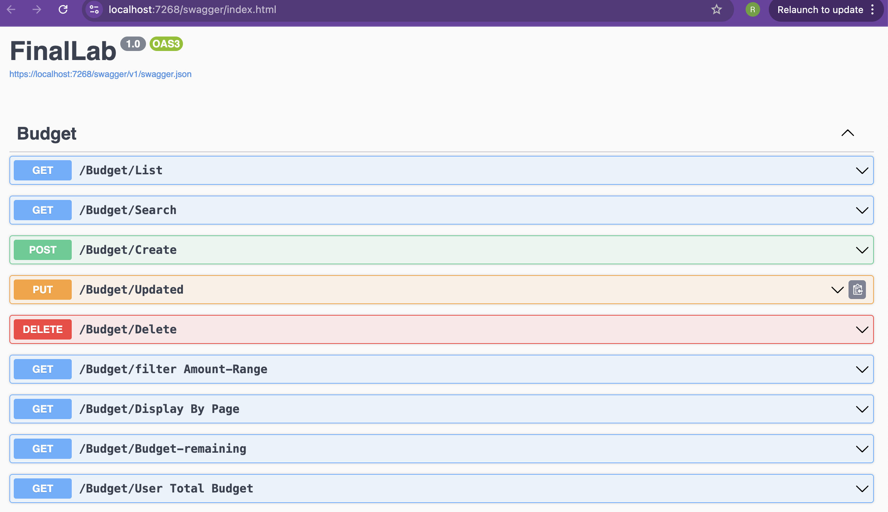
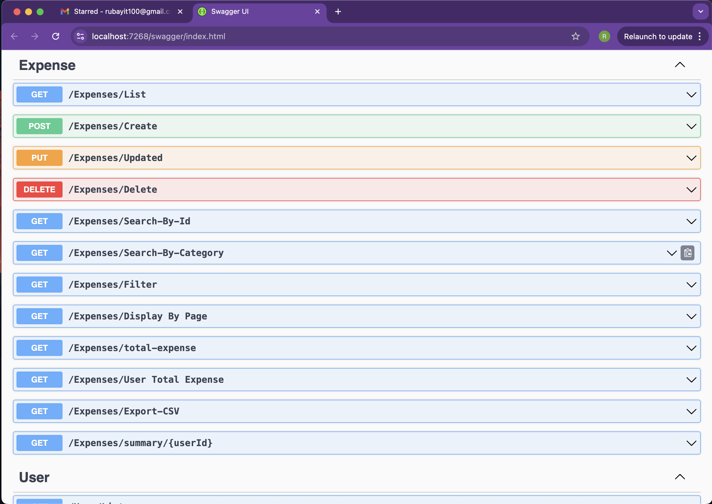
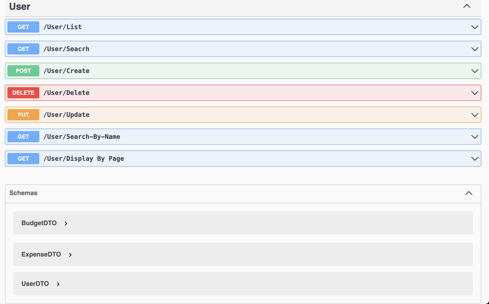

# Expense-Tracker-System-ASP.NET-CORE
Expense Tracker is a simple ASP.NET Core web app to manage personal expenses. Users can add, edit, delete, filter, set budgets, and export data to CSV.
---

## Features

* User login and registration
* Add, view, edit, delete expense records
* Display expense details (amount, category, date, description)
* Filter expenses by category or date
* Recurring expenses
* Export expenses to CSV
* Budget setting and tracking
* Pagination

---

## Screenshots


# Dashboard


# Add Expense


# Expense List

```
---

## Technology Stack

* **Backend:** ASP.NET Core
* **Frontend:** Razor Pages / MVC
* **Database:** SQL Server / SQLite
* **API Testing:** Swagger

---

## Installation

```bash
# Clone the repository
git clone https://github.com/rubayitalam/expense-tracker.git

# Navigate to project folder
cd expense-tracker

# Restore dependencies
dotnet restore

# Run the project
dotnet run
```

---

## API Testing

* Swagger available at: `https://localhost:5001/swagger`

---

## Project Structure

```bash
ExpenseTracker/
│
├─ ExpenseTracker.sln
├─ BLL/          # Business Logic Layer
├─ DAL/          # Data Access Layer
├─ Presentation/ # MVC/Razor Pages Layer
├─ Screenshot/   # Project screenshots
└─ README.md
```

---

## Author

**Rubayit Alam** – Full-Stack Developer

GitHub:  [https://github.com/rubayitalam](https://github.com/rubayitalam)

Email: rubayit100@gmail.com
